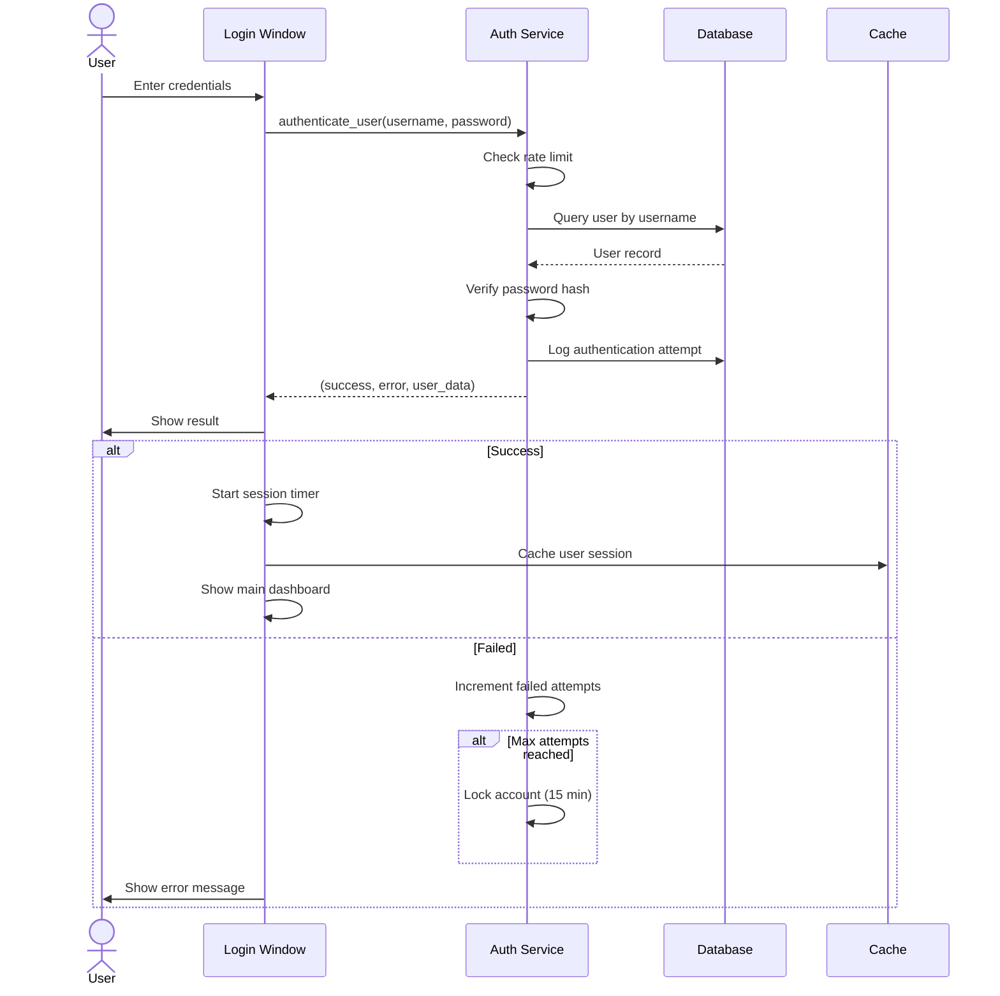
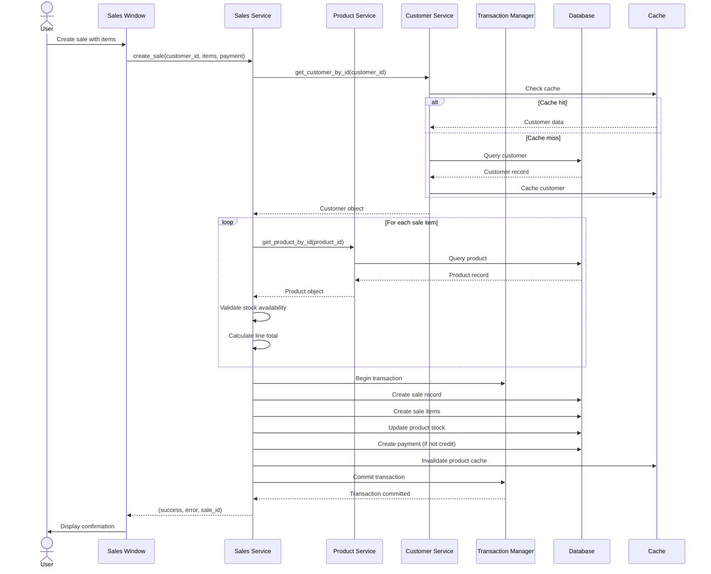
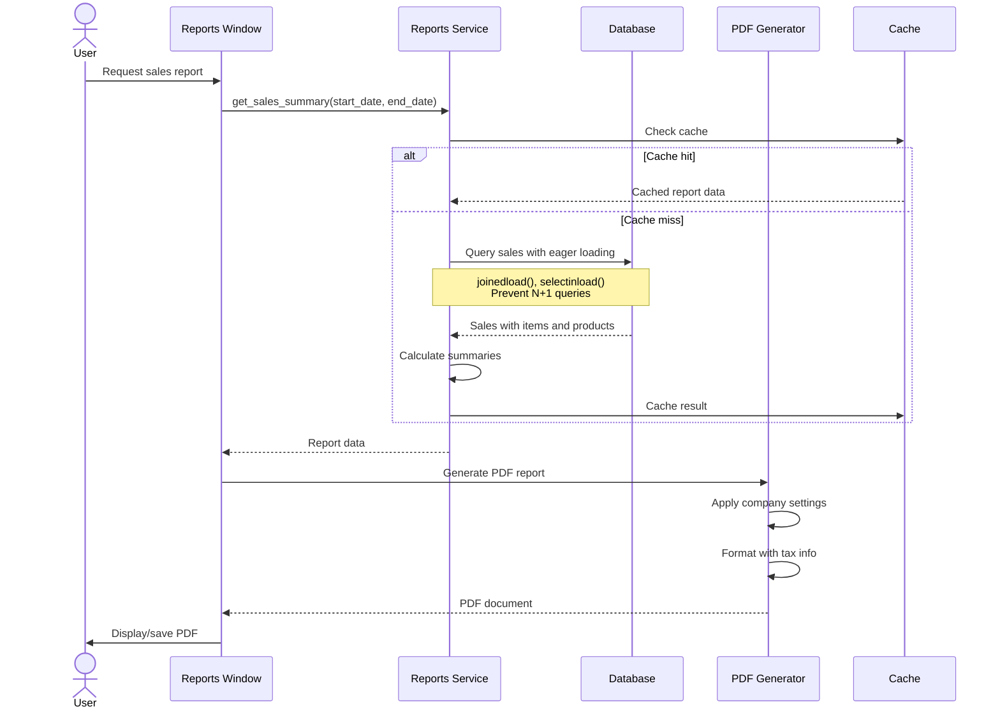
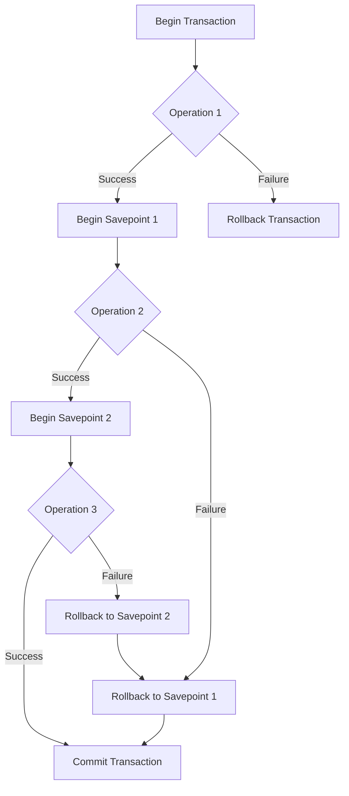
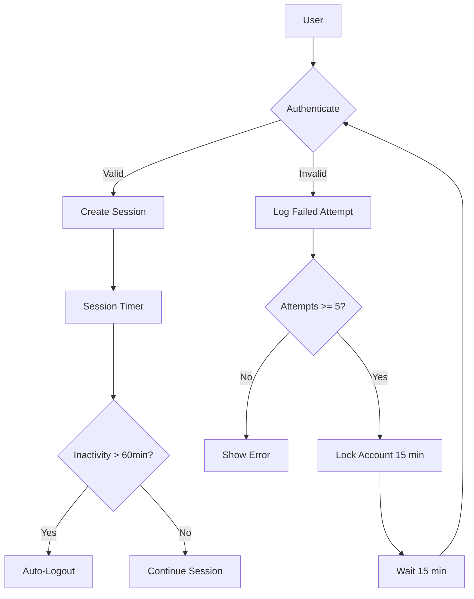
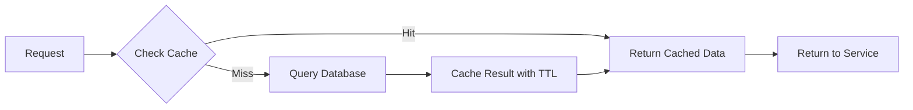

# ERP Paraguay V6 - System Architecture

This document provides an overview of the ERP Paraguay V6 system architecture, including the layered design, component interactions, and data flow.

## Architecture Overview

ERP Paraguay V6 follows a **three-tier layered architecture** with clear separation of concerns:

```
┌─────────────────────────────────────────────────────────────┐
│                     Presentation Layer                       │
│                        (UI Layer)                            │
│  ┌────────────┐  ┌────────────┐  ┌────────────┐             │
│  │  Login UI  │  │  Dashboard │  │  Forms UI  │             │
│  └────────────┘  └────────────┘  └────────────┘             │
└─────────────────────────────────────────────────────────────┘
                             ↓
┌─────────────────────────────────────────────────────────────┐
│                    Business Logic Layer                      │
│                      (Services Layer)                        │
│  ┌──────────────┐  ┌──────────────┐  ┌──────────────┐      │
│  │ Auth Service │  │ Sales Svc    │  │ Product Svc  │      │
│  ├──────────────┤  ├──────────────┤  ├──────────────┤      │
│  │ Customer Svc │  │ Inventory Svc│  │ Report Svc   │      │
│  ├──────────────┤  ├──────────────┤  ├──────────────┤      │
│  │ Financial Svc│  │ User Svc     │  │ Category Svc │      │
│  └──────────────┘  └──────────────┘  └──────────────┘      │
└─────────────────────────────────────────────────────────────┘
                             ↓
┌─────────────────────────────────────────────────────────────┐
│                      Data Access Layer                       │
│                   (Repository & Database)                    │
│  ┌──────────────┐  ┌──────────────┐  ┌──────────────┐      │
│  │Base Repo     │  │ Transaction  │  │   Cache      │      │
│  │(Generic CRUD)│  │  Manager     │  │  (In-Memory) │      │
│  └──────────────┘  └──────────────┘  └──────────────┘      │
└─────────────────────────────────────────────────────────────┘
                             ↓
┌─────────────────────────────────────────────────────────────┐
│                    PostgreSQL Database                       │
│                  (11 Tables + Relationships)                 │
└─────────────────────────────────────────────────────────────┘
```

## Layer Responsibilities

### Presentation Layer (UI)
- **Technology**: Tkinter (Python GUI)
- **Location**: `app/ui/`
- **Responsibilities**:
  - Display forms and windows
  - Handle user input
  - Validate basic input format
  - Display error messages
  - Manage session state
- **Key Components**:
  - `main_window.py` - Main application window and login
  - `sales_window.py` - Sales management UI
  - `customers_window.py` - Customer management UI
  - `suppliers_window.py` - Supplier management UI
  - Other specialized UI components

### Business Logic Layer (Services)
- **Location**: `app/services/`
- **Responsibilities**:
  - Implement business rules
  - Validate business constraints
  - Coordinate data operations
  - Handle errors and exceptions
  - Manage transactions
  - Apply business logic
- **Key Components**:
  - `auth_service.py` - Authentication and authorization
  - `sales_management_service.py` - Sales workflow
  - `customer_service.py` - Customer management
  - `product_service.py` - Product catalog
  - `financial_service.py` - Financial operations
  - `reports_service.py` - Report generation
  - Other service modules

### Data Access Layer
- **Location**: `app/database/`
- **Responsibilities**:
  - Database connection management
  - ORM model definitions
  - CRUD operations
  - Transaction management
  - Query optimization
  - Caching
- **Key Components**:
  - `db.py` - Database engine and session management
  - `models.py` - SQLAlchemy ORM models
  - `repository.py` - Generic repository pattern
  - `init_db.py` - Database initialization

## Component Interactions

### User Authentication Flow



### Sales Creation Flow



### Report Generation Flow



## Data Flow Patterns

### CRUD Operations Pattern

All data access follows the **Repository Pattern**:

```
UI → Service → Repository → Database → Cache
```

1. **UI Layer**: Receives user request
2. **Service Layer**: Applies business logic
3. **Repository Layer**: Executes database operations
4. **Cache Layer**: Caches frequently-accessed data
5. **Database**: Persists data

### Error Handling Pattern

All layers follow the **Result[T] pattern** for consistent error handling:

```python
# Service layer returns:
Result[T] = Tuple[bool, Optional[str], Optional[T]]

# Where:
# - bool: Success (True) or Failure (False)
# - Optional[str]: Error message (None if success)
# - Optional[T]: Result data (None if failure)
```

### Transaction Management Pattern

Complex operations use **Nested Transactions** with savepoints:



## Security Architecture

### Authentication & Authorization



### Audit Logging

All security events are logged with structured JSON format:

```json
{
  "timestamp": "2025-03-14T10:30:45Z",
  "level": "INFO",
  "logger": "app.services.auth_service",
  "message": "User login successful",
  "environment": "production",
  "user_id": 1,
  "username": "admin",
  "ip_address": "192.168.1.100",
  "request_id": "abc123"
}
```

## Performance Architecture

### Caching Strategy



**Cache TTL Configuration:**
- Categories: 1 hour (3600s)
- Products: 5 minutes (300s)
- Customers: 10 minutes (600s)
- Suppliers: 10 minutes (600s)
- Settings: 30 minutes (1800s)

### Query Optimization

The application uses **SQLAlchemy eager loading** to prevent N+1 queries:

```python
# Before (N+1 problem):
sales = db.query(Sale).all()
for sale in sales:
    print(sale.items)  # N+1 query!

# After (optimized):
sales = db.query(Sale).options(
    selectinload(Sale.items)
).all()
for sale in sales:
    print(sale.items)  # No additional query
```

## Technology Stack

| Layer | Technology | Purpose |
|-------|-----------|---------|
| **UI** | Tkinter | Desktop GUI framework |
| **Business Logic** | Python 3.11+ | Service layer implementation |
| **Data Access** | SQLAlchemy 2.0+ | ORM and database abstraction |
| **Database** | PostgreSQL 14+ | Relational data storage |
| **Caching** | functools.lru_cache | In-memory caching |
| **PDF Generation** | ReportLab | Report generation |
| **Password Hashing** | passlib + bcrypt | Secure password storage |
| **Logging** | Python logging + JSON | Structured logging |
| **Testing** | pytest | Unit and integration tests |

## File Structure

```
erpnexos/
├── main.py                          # Application entry point
├── app/
│   ├── config.py                    # Configuration management
│   ├── settings.py                  # Business settings groups
│   ├── types.py                     # Type aliases
│   ├── exceptions.py                # Custom exceptions
│   ├── cache.py                     # Caching layer
│   ├── validators.py                # Input validators
│   ├── database/
│   │   ├── db.py                    # Database engine
│   │   ├── models.py                # ORM models
│   │   ├── repository.py            # Base repository
│   │   └── init_db.py               # Database initialization
│   ├── services/
│   │   ├── auth_service.py          # Authentication
│   │   ├── sales_management_service.py  # Sales workflow
│   │   ├── customer_service.py      # Customer management
│   │   ├── product_service.py       # Product catalog
│   │   ├── financial_service.py     # Financial operations
│   │   ├── reports_service.py       # Report generation
│   │   └── ...                      # Other services
│   ├── ui/
│   │   ├── main_window.py           # Main window
│   │   ├── sales_window.py          # Sales UI
│   │   ├── customers_window.py      # Customer UI
│   │   └── ...                      # Other UI modules
│   └── reports/
│       ├── pdf_reports.py           # PDF generation
│       └── pdf_helpers.py           # PDF utilities
├── tests/
│   ├── conftest.py                  # Test fixtures
│   ├── test_services/               # Service tests
│   ├── test_integration/            # Integration tests
│   └── test_*.py                    # Other test files
├── docs/
│   └── diagrams/                    # Architecture diagrams
├── logs/                            # Application logs
├── .env.example                     # Environment template
└── requirements.txt                 # Dependencies
```

## Design Patterns Used

| Pattern | Location | Purpose |
|---------|----------|---------|
| **Repository Pattern** | `app/database/repository.py` | Generic CRUD operations |
| **Service Layer Pattern** | `app/services/` | Business logic encapsulation |
| **Singleton Pattern** | `app/cache.py` | Single cache instance |
| **Factory Pattern** | `app/database/db.py` | Session creation |
| **Result Pattern** | `app/types.py` | Consistent error handling |
| **Decorator Pattern** | `app/cache.py` | Caching decorator |
| **Template Method** | `app/database/repository.py` | Base repository template |
| **Strategy Pattern** | `app/reports/pdf_reports.py` | Report generation strategies |

## Scalability Considerations

### Current Architecture (Desktop)
- Single-user desktop application
- In-memory caching
- Direct database connections
- Suitable for small businesses

### Future Scalability Options

1. **Multi-User Support**
   - Add user roles and permissions
   - Implement row-level security
   - Add concurrent access control

2. **Client-Server Architecture**
   - Separate UI to client application
   - Expose services via REST API
   - Add authentication middleware

3. **Database Optimization**
   - Add read replicas for reporting
   - Implement connection pooling
   - Add database indexing strategy

4. **Distributed Caching**
   - Replace in-memory cache with Redis
   - Implement cache invalidation strategy
   - Add cache warming on startup

---

**Document Version:** 1.0
**Last Updated:** 2025-03-14
