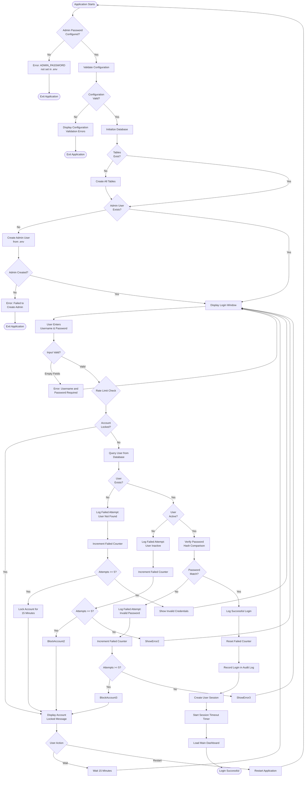
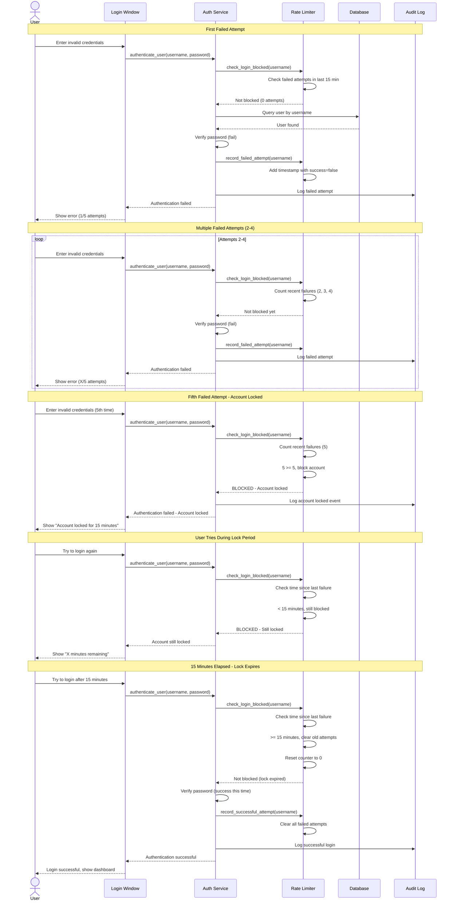
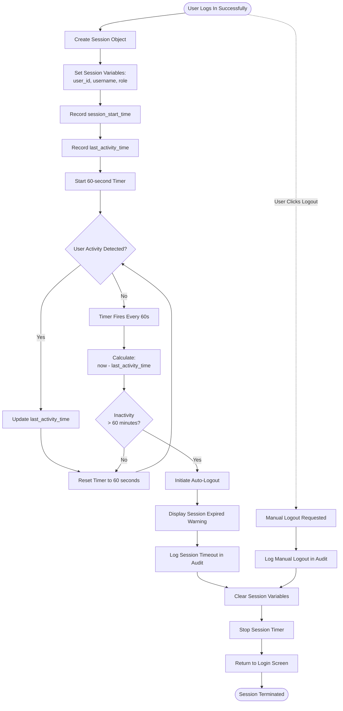
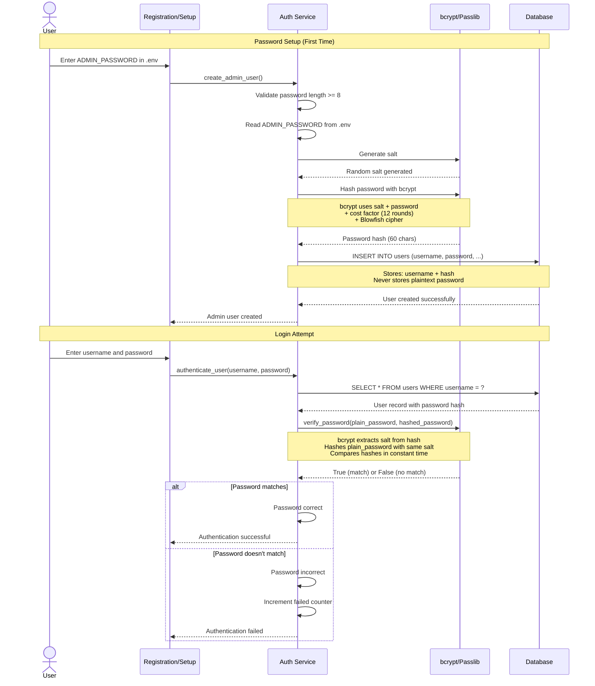
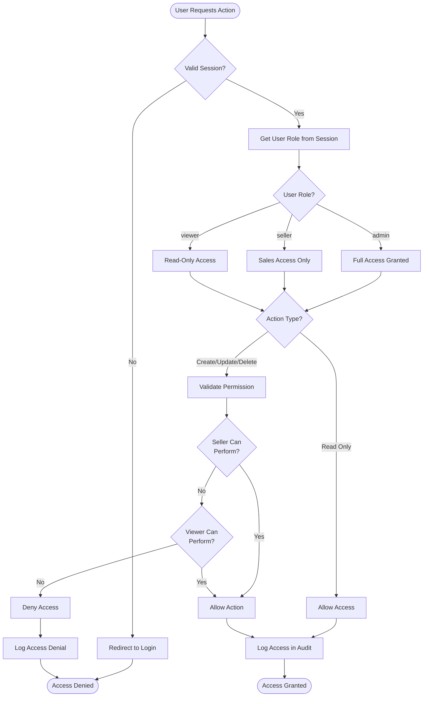
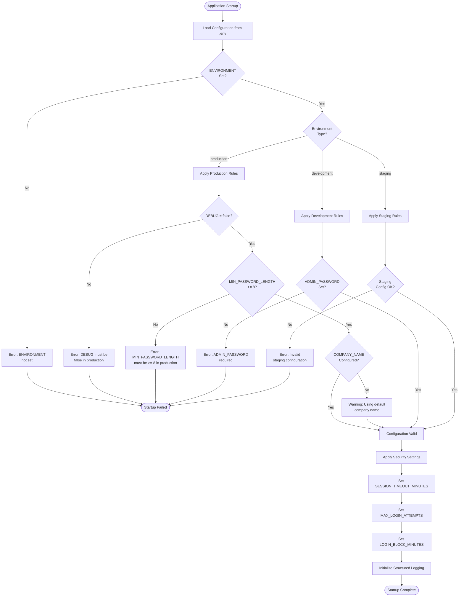

# ERP Paraguay V6 - Authentication Workflow

This document provides detailed flowcharts and documentation for the authentication and authorization system in ERP Paraguay V6.

## Login Process Flow



## Rate Limiting Mechanism



## Session Management Flow



## Password Hashing and Verification



## Audit Logging Flow

```mermaid
flowchart TD
    Start([Authentication Event]) --> DetermineType{Event Type}

    DetermineType -->|Login Success| LogSuccess[Log LOGIN_SUCCESS]
    DetermineType -->|Login Failed| LogFailed[Log LOGIN_FAILED]
    DetermineType -->|Account Locked| LogLocked[Log ACCOUNT_LOCKED]
    DetermineType -->|Session Expired| LogExpired[Log SESSION_EXPIRED]
    DetermineType -->|Logout| LogLogout[Log LOGOUT]

    LogSuccess --> GatherData1[Collect Event Data]
    LogFailed --> GatherData2[Collect Event Data]
    LogLocked --> GatherData3[Collect Event Data]
    LogExpired --> GatherData4[Collect Event Data]
    LogLogout --> GatherData5[Collect Event Data]

    GatherData1 --> BuildLog
    GatherData2 --> BuildLog[Build Audit Log Entry]
    GatherData3 --> BuildLog
    GatherData4 --> BuildLog
    GatherData5 --> BuildLog

    BuildLog --> AddTimestamp[Add timestamp (UTC)]
    AddTimestamp --> AddUser[Add user_id and username]
    AddUser --> AddAction[Add action type]
    AddAction --> AddDetails[Add additional details]
    AddDetails --> AddContext[Add request_id and environment]

    AddContext --> FormatJSON[Format as JSON]
    FormatJSON --> WriteLog[Write to app.log]
    WriteLog --> SaveDB[Save to audit_logs table]

    SaveDB --> DBSuccess{Saved Successfully?}
    DBSuccess --> |Yes| End([Audit Log Complete])
    DBSuccess --> |No| LogError[Log Error to Console]
    LogError --> End
```

## Authorization Flow



## Security Configuration



## Password Recovery Flow (Future Enhancement)

```mermaid
flowchart TD
    Start([User Clicks "Forgot Password"]) --> EnterEmail[Enter Email Address]
    EnterEmail --> ValidateEmail{Email Format<br/>Valid?}
    ValidateEmail --> |No| Error1[Error: Invalid Email Format]
    ValidateEmail --> |Yes| QueryUser

    Error1 --> EnterEmail

    QueryUser[Query User by Email] --> UserExists{User<br/>Exists?}
    UserExists --> |No| Error2[Error: No account with<br/>this email]
    UserExists --> |Yes| GenerateToken

    Error2 --> End([Process Complete])

    GenerateToken[Generate Secure Reset Token] --> SaveToken[Save Token to Database<br/>with Expiry]
    SaveToken --> SendEmail[Send Reset Email<br/>with Token Link]
    SendEmail --> DisplayMessage[Display: Check your email]

    DisplayMessage --> UserClicks[User Clicks Email Link]
    UserClicks --> ValidateToken{Token Valid?}
    ValidateToken --> |Expired| Error3[Error: Token expired]
    ValidateToken --> |Invalid| Error4[Error: Invalid token]
    ValidateToken --> |Valid| ShowPasswordForm

    Error3 --> End
    Error4 --> End

    ShowPasswordForm[Display New Password Form] --> EnterNewPassword[Enter New Password]
    EnterNewPassword --> ValidateNewPassword{Password<br/>Valid?}
    ValidateNewPassword --> |Too Short| Error5[Error: Password must be<br/>at least 8 characters]
    ValidateNewPassword --> |Weak| Warning[Warning: Consider using<br/>a stronger password]
    ValidateNewPassword --> |Valid| ConfirmPassword

    Error5 --> EnterNewPassword
    Warning --> ConfirmPassword{User Confirms?}
    ConfirmPassword --> |No| EnterNewPassword
    ConfirmPassword --> |Yes| HashPassword

    HashPassword[Hash New Password] --> UpdateDB[Update Password in Database]
    UpdateDB --> InvalidateTokens[Invalidate All Reset Tokens]
    InvalidateTokens --> LogPasswordChange[Log Password Change in Audit]
    LogPasswordChange --> Success([Password Reset Successful])
```

## Security Best Practices Implemented

### 1. Password Security
- ✅ Bcrypt hashing with cost factor 12
- ✅ Salt automatically generated by bcrypt
- ✅ Minimum password length: 8 characters
- ✅ No plaintext password storage
- ✅ Constant-time comparison to prevent timing attacks

### 2. Rate Limiting
- ✅ 5 failed attempts trigger 15-minute lockout
- ✅ Attempt counter per username
- ✅ Automatic lock expiration after time window
- ✅ Failed attempts logged in audit trail

### 3. Session Management
- ✅ Automatic session timeout after 60 minutes
- ✅ Activity tracking with timestamp updates
- ✅ Session checker runs every 60 seconds
- ✅ Automatic logout on session expiration

### 4. Audit Logging
- ✅ All authentication events logged
- ✅ Structured JSON format for parsing
- ✅ Timestamps in UTC
- ✅ User context included in logs
- ✅ Request tracking with request_id

### 5. Configuration Security
- ✅ No hardcoded credentials
- ✅ Environment-based configuration
- ✅ Production-specific validation rules
- ✅ Configuration validation at startup

### 6. Error Handling
- ✅ Generic error messages to users
- ✅ Detailed logging for debugging
- ✅ No sensitive information in errors
- ✅ Stack traces logged but not shown to users

---

**Document Version:** 1.0
**Last Updated:** 2025-03-14
