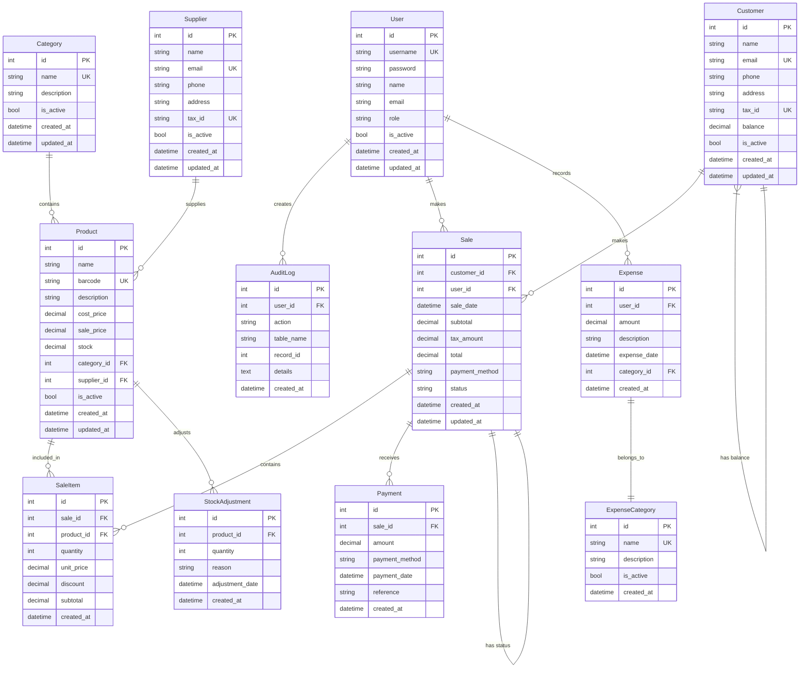

# ERP Paraguay V6 - Database Schema

This document provides the Entity-Relationship (ER) diagram and detailed schema information for ERP Paraguay V6.

## Entity-Relationship Diagram



## Table Details

### 1. users

Stores system user accounts and authentication credentials.

| Column | Type | Constraints | Description |
|--------|------|-------------|-------------|
| id | INTEGER | PRIMARY KEY, AUTO_INCREMENT | Unique identifier |
| username | VARCHAR(50) | UNIQUE, NOT NULL | Login username |
| password | VARCHAR(255) | NOT NULL | Bcrypt hashed password |
| name | VARCHAR(100) | NOT NULL | Full name |
| email | VARCHAR(100) | UNIQUE | Email address |
| role | VARCHAR(20) | NOT NULL, DEFAULT 'admin' | User role (admin/seller/viewer) |
| is_active | BOOLEAN | NOT NULL, DEFAULT TRUE | Active status |
| created_at | TIMESTAMP | NOT NULL, DEFAULT NOW() | Creation timestamp |
| updated_at | TIMESTAMP | NOT NULL, DEFAULT NOW() | Last update timestamp |

**Indexes:**
- `idx_users_username` on `username`
- `idx_users_email` on `email`
- `idx_users_is_active` on `is_active`

**Relationships:**
- One-to-many with `audit_logs` (user creates audit logs)
- One-to-many with `sales` (user makes sales)
- One-to-many with `expenses` (user records expenses)

---

### 2. customers

Stores customer information and account balances.

| Column | Type | Constraints | Description |
|--------|------|-------------|-------------|
| id | INTEGER | PRIMARY KEY, AUTO_INCREMENT | Unique identifier |
| name | VARCHAR(100) | NOT NULL | Customer name |
| email | VARCHAR(100) | UNIQUE | Email address |
| phone | VARCHAR(20) | | Phone number |
| address | VARCHAR(200) | | Street address |
| tax_id | VARCHAR(20) | UNIQUE | Tax ID (RUC/Cedula) |
| balance | DECIMAL(10,2) | NOT NULL, DEFAULT 0 | Account balance (credit) |
| is_active | BOOLEAN | NOT NULL, DEFAULT TRUE | Active status |
| created_at | TIMESTAMP | NOT NULL, DEFAULT NOW() | Creation timestamp |
| updated_at | TIMESTAMP | NOT NULL, DEFAULT NOW() | Last update timestamp |

**Indexes:**
- `idx_customers_name` on `name`
- `idx_customers_email` on `email`
- `idx_customers_tax_id` on `tax_id`
- `idx_customers_is_active` on `is_active`

**Relationships:**
- One-to-many with `sales` (customer makes purchases)
- One-to-many with `payments` (customer makes payments)

**Business Rules:**
- `balance` increases with credit sales
- `balance` decreases with payments
- Credit sales require customer balance validation

---

### 3. suppliers

Stores supplier information for product sourcing.

| Column | Type | Constraints | Description |
|--------|------|-------------|-------------|
| id | INTEGER | PRIMARY KEY, AUTO_INCREMENT | Unique identifier |
| name | VARCHAR(100) | NOT NULL | Supplier name |
| email | VARCHAR(100) | UNIQUE | Email address |
| phone | VARCHAR(20) | | Phone number |
| address | VARCHAR(200) | | Street address |
| tax_id | VARCHAR(20) | UNIQUE | Tax ID (RUC/Cedula) |
| is_active | BOOLEAN | NOT NULL, DEFAULT TRUE | Active status |
| created_at | TIMESTAMP | NOT NULL, DEFAULT NOW() | Creation timestamp |
| updated_at | TIMESTAMP | NOT NULL, DEFAULT NOW() | Last update timestamp |

**Indexes:**
- `idx_suppliers_name` on `name`
- `idx_suppliers_email` on `email`
- `idx_suppliers_tax_id` on `tax_id`
- `idx_suppliers_is_active` on `is_active`

**Relationships:**
- One-to-many with `products` (supplier provides products)

---

### 4. categories

Stores product categories for organizing inventory.

| Column | Type | Constraints | Description |
|--------|------|-------------|-------------|
| id | INTEGER | PRIMARY KEY, AUTO_INCREMENT | Unique identifier |
| name | VARCHAR(50) | UNIQUE, NOT NULL | Category name |
| description | VARCHAR(200) | | Category description |
| is_active | BOOLEAN | NOT NULL, DEFAULT TRUE | Active status |
| created_at | TIMESTAMP | NOT NULL, DEFAULT NOW() | Creation timestamp |
| updated_at | TIMESTAMP | NOT NULL, DEFAULT NOW() | Last update timestamp |

**Indexes:**
- `idx_categories_name` on `name`
- `idx_categories_is_active` on `is_active`

**Relationships:**
- One-to-many with `products` (category contains products)

---

### 5. products

Stores product catalog and inventory information.

| Column | Type | Constraints | Description |
|--------|------|-------------|-------------|
| id | INTEGER | PRIMARY KEY, AUTO_INCREMENT | Unique identifier |
| name | VARCHAR(100) | NOT NULL | Product name |
| barcode | VARCHAR(50) | UNIQUE | Barcode/UPC |
| description | TEXT | | Product description |
| cost_price | DECIMAL(10,2) | NOT NULL | Cost price |
| sale_price | DECIMAL(10,2) | NOT NULL | Sale price |
| stock | DECIMAL(10,2) | NOT NULL, DEFAULT 0 | Current stock |
| category_id | INTEGER | FK → categories.id | Product category |
| supplier_id | INTEGER | FK → suppliers.id | Primary supplier |
| is_active | BOOLEAN | NOT NULL, DEFAULT TRUE | Active status |
| created_at | TIMESTAMP | NOT NULL, DEFAULT NOW() | Creation timestamp |
| updated_at | TIMESTAMP | NOT NULL, DEFAULT NOW() | Last update timestamp |

**Indexes:**
- `idx_products_name` on `name`
- `idx_products_barcode` on `barcode`
- `idx_products_category_id` on `category_id`
- `idx_products_supplier_id` on `supplier_id`
- `idx_products_is_active` on `is_active`

**Relationships:**
- Many-to-one with `categories` (product belongs to category)
- Many-to-one with `suppliers` (product from supplier)
- One-to-many with `sale_items` (product in sales)
- One-to-many with `stock_adjustments` (product inventory changes)

**Business Rules:**
- `stock` cannot be negative
- `sale_price` must be >= `cost_price`
- Barcode validation on creation

---

### 6. sales

Stores sales transaction headers.

| Column | Type | Constraints | Description |
|--------|------|-------------|-------------|
| id | INTEGER | PRIMARY KEY, AUTO_INCREMENT | Unique identifier |
| customer_id | INTEGER | FK → customers.id | Customer (nullable) |
| user_id | INTEGER | FK → users.id, NOT NULL | Salesperson |
| sale_date | TIMESTAMP | NOT NULL, DEFAULT NOW() | Sale date/time |
| subtotal | DECIMAL(10,2) | NOT NULL | Subtotal before tax |
| tax_amount | DECIMAL(10,2) | NOT NULL | Tax amount |
| total | DECIMAL(10,2) | NOT NULL | Total including tax |
| payment_method | VARCHAR(20) | NOT NULL | Payment method |
| status | VARCHAR(20) | NOT NULL | Sale status |
| created_at | TIMESTAMP | NOT NULL, DEFAULT NOW() | Creation timestamp |
| updated_at | TIMESTAMP | NOT NULL, DEFAULT NOW() | Last update timestamp |

**Payment Method Options:**
- `cash` - Cash payment
- `credit` - Credit sale (adds to customer balance)
- `debit` - Debit card
- `transfer` - Bank transfer

**Status Options:**
- `pending` - Sale in progress
- `completed` - Sale finalized
- `cancelled` - Sale cancelled (stock restored)

**Indexes:**
- `idx_sales_customer_id` on `customer_id`
- `idx_sales_user_id` on `user_id`
- `idx_sales_sale_date` on `sale_date`
- `idx_sales_status` on `status`
- `idx_sales_payment_method` on `payment_method`

**Relationships:**
- Many-to-one with `customers` (sale to customer)
- Many-to-one with `users` (sale by user)
- One-to-many with `sale_items` (sale contains items)
- One-to-many with `payments` (sale receives payments)

**Business Rules:**
- `total` = `subtotal` + `tax_amount`
- `tax_amount` = `subtotal` × TAX_RATE (default 10%)
- Credit sales increase customer balance
- Cancelling restores product stock

---

### 7. sale_items

Stores individual line items for sales.

| Column | Type | Constraints | Description |
|--------|------|-------------|-------------|
| id | INTEGER | PRIMARY KEY, AUTO_INCREMENT | Unique identifier |
| sale_id | INTEGER | FK → sales.id, NOT NULL | Parent sale |
| product_id | INTEGER | FK → products.id, NOT NULL | Product sold |
| quantity | DECIMAL(10,2) | NOT NULL | Quantity sold |
| unit_price | DECIMAL(10,2) | NOT NULL | Price per unit |
| discount | DECIMAL(10,2) | NOT NULL, DEFAULT 0 | Discount amount |
| subtotal | DECIMAL(10,2) | NOT NULL | Line subtotal |
| created_at | TIMESTAMP | NOT NULL, DEFAULT NOW() | Creation timestamp |

**Indexes:**
- `idx_sale_items_sale_id` on `sale_id`
- `idx_sale_items_product_id` on `product_id`

**Relationships:**
- Many-to-one with `sales` (item belongs to sale)
- Many-to-one with `products` (item is product)

**Business Rules:**
- `subtotal` = (`unit_price` × `quantity`) - `discount`
- Quantity cannot exceed available stock
- Unit price captured at time of sale

---

### 8. payments

Stores payments applied to sales (for credit sales).

| Column | Type | Constraints | Description |
|--------|------|-------------|-------------|
| id | INTEGER | PRIMARY KEY, AUTO_INCREMENT | Unique identifier |
| sale_id | INTEGER | FK → sales.id, NOT NULL | Related sale |
| amount | DECIMAL(10,2) | NOT NULL | Payment amount |
| payment_method | VARCHAR(20) | NOT NULL | Payment method |
| payment_date | TIMESTAMP | NOT NULL, DEFAULT NOW() | Payment date/time |
| reference | VARCHAR(50) | | Payment reference |
| created_at | TIMESTAMP | NOT NULL, DEFAULT NOW() | Creation timestamp |

**Indexes:**
- `idx_payments_sale_id` on `sale_id`
- `idx_payments_payment_date` on `payment_date`
- `idx_payments_payment_method` on `payment_method`

**Relationships:**
- Many-to-one with `sales` (payment for sale)

**Business Rules:**
- Sum of payments cannot exceed sale total
- Payment reduces customer balance for credit sales
- Partial payments allowed for installment plans

---

### 9. expenses

Stores business expense records.

| Column | Type | Constraints | Description |
|--------|------|-------------|-------------|
| id | INTEGER | PRIMARY KEY, AUTO_INCREMENT | Unique identifier |
| user_id | INTEGER | FK → users.id, NOT NULL | Recording user |
| amount | DECIMAL(10,2) | NOT NULL | Expense amount |
| description | TEXT | NOT NULL | Expense description |
| expense_date | TIMESTAMP | NOT NULL, DEFAULT NOW() | Expense date |
| category_id | INTEGER | FK → expense_categories.id | Expense category |
| created_at | TIMESTAMP | NOT NULL, DEFAULT NOW() | Creation timestamp |

**Indexes:**
- `idx_expenses_user_id` on `user_id`
- `idx_expenses_expense_date` on `expense_date`
- `idx_expenses_category_id` on `category_id`

**Relationships:**
- Many-to-one with `users` (expense recorded by)
- Many-to-one with `expense_categories` (expense category)

---

### 10. expense_categories

Stores expense category classifications.

| Column | Type | Constraints | Description |
|--------|------|-------------|-------------|
| id | INTEGER | PRIMARY KEY, AUTO_INCREMENT | Unique identifier |
| name | VARCHAR(50) | UNIQUE, NOT NULL | Category name |
| description | VARCHAR(200) | | Category description |
| is_active | BOOLEAN | NOT NULL, DEFAULT TRUE | Active status |
| created_at | TIMESTAMP | NOT NULL, DEFAULT NOW() | Creation timestamp |

**Indexes:**
- `idx_expense_categories_name` on `name`
- `idx_expense_categories_is_active` on `is_active`

**Relationships:**
- One-to-many with `expenses` (category has expenses)

---

### 11. stock_adjustments

Stores inventory adjustment records.

| Column | Type | Constraints | Description |
|--------|------|-------------|-------------|
| id | INTEGER | PRIMARY KEY, AUTO_INCREMENT | Unique identifier |
| product_id | INTEGER | FK → products.id, NOT NULL | Adjusted product |
| quantity | DECIMAL(10,2) | NOT NULL | Adjustment amount |
| reason | VARCHAR(200) | NOT NULL | Adjustment reason |
| adjustment_date | TIMESTAMP | NOT NULL, DEFAULT NOW() | Adjustment date |
| created_at | TIMESTAMP | NOT NULL, DEFAULT NOW() | Creation timestamp |

**Indexes:**
- `idx_stock_adjustments_product_id` on `product_id`
- `idx_stock_adjustments_adjustment_date` on `adjustment_date`

**Relationships:**
- Many-to-one with `products` (adjustment for product)

**Business Rules:**
- Positive `quantity` = stock increase
- Negative `quantity` = stock decrease
- Must adjust product stock accordingly

---

### 12. audit_logs

Stores security audit trail for system events.

| Column | Type | Constraints | Description |
|--------|------|-------------|-------------|
| id | INTEGER | PRIMARY KEY, AUTO_INCREMENT | Unique identifier |
| user_id | INTEGER | FK → users.id | Acting user |
| action | VARCHAR(50) | NOT NULL | Action performed |
| table_name | VARCHAR(50) | NOT NULL | Affected table |
| record_id | INTEGER | | Affected record ID |
| details | TEXT | | Additional details (JSON) |
| created_at | TIMESTAMP | NOT NULL, DEFAULT NOW() | Event timestamp |

**Actions Tracked:**
- `LOGIN_SUCCESS` / `LOGIN_FAILED`
- `CREATE_*` / `UPDATE_*` / `DELETE_*`
- `SALE_COMPLETED` / `SALE_CANCELLED`
- `PAYMENT_RECEIVED`
- `STOCK_ADJUSTED`

**Indexes:**
- `idx_audit_logs_user_id` on `user_id`
- `idx_audit_logs_action` on `action`
- `idx_audit_logs_table_name` on `table_name`
- `idx_audit_logs_created_at` on `created_at`

**Relationships:**
- Many-to-one with `users` (log entry by user)

---

## Relationships Summary

| Relationship | Type | Description |
|--------------|------|-------------|
| users → audit_logs | One-to-Many | User creates audit log entries |
| users → sales | One-to-Many | User makes sales |
| users → expenses | One-to-Many | User records expenses |
| categories → products | One-to-Many | Category contains products |
| customers → sales | One-to-Many | Customer makes purchases |
| suppliers → products | One-to-Many | Supplier provides products |
| products → sale_items | One-to-Many | Product appears in sales |
| products → stock_adjustments | One-to-Many | Product has stock adjustments |
| sales → sale_items | One-to-Many | Sale contains items |
| sales → payments | One-to-Many | Sale receives payments |
| expense_categories → expenses | One-to-Many | Category classifies expenses |

## Database Constraints

### Foreign Key Constraints

```sql
-- Sale items must reference valid sale and product
ALTER TABLE sale_items ADD CONSTRAINT fk_sale_items_sale
    FOREIGN KEY (sale_id) REFERENCES sales(id) ON DELETE CASCADE;

ALTER TABLE sale_items ADD CONSTRAINT fk_sale_items_product
    FOREIGN KEY (product_id) REFERENCES products(id);

-- Payments must reference valid sale
ALTER TABLE payments ADD CONSTRAINT fk_payments_sale
    FOREIGN KEY (sale_id) REFERENCES sales(id) ON DELETE CASCADE;

-- Products must reference valid category and supplier
ALTER TABLE products ADD CONSTRAINT fk_products_category
    FOREIGN KEY (category_id) REFERENCES categories(id);

ALTER TABLE products ADD CONSTRAINT fk_products_supplier
    FOREIGN KEY (supplier_id) REFERENCES suppliers(id);

-- Sales must reference valid customer and user
ALTER TABLE sales ADD CONSTRAINT fk_sales_customer
    FOREIGN KEY (customer_id) REFERENCES customers(id);

ALTER TABLE sales ADD CONSTRAINT fk_sales_user
    FOREIGN KEY (user_id) REFERENCES users(id);

-- Stock adjustments must reference valid product
ALTER TABLE stock_adjustments ADD CONSTRAINT fk_stock_adjustments_product
    FOREIGN KEY (product_id) REFERENCES products(id);

-- Audit logs must reference valid user
ALTER TABLE audit_logs ADD CONSTRAINT fk_audit_logs_user
    FOREIGN KEY (user_id) REFERENCES users(id);
```

### Check Constraints

```sql
-- Product stock cannot be negative
ALTER TABLE products ADD CONSTRAINT chk_products_stock_positive
    CHECK (stock >= 0);

-- Sale price must be >= cost price
ALTER TABLE products ADD CONSTRAINT chk_products_profit_margin
    CHECK (sale_price >= cost_price);

-- Customer balance cannot be negative (optional, depends on business rules)
ALTER TABLE customers ADD CONSTRAINT chk_customers_balance_positive
    CHECK (balance >= 0);

-- Sale totals must be positive
ALTER TABLE sales ADD CONSTRAINT chk_sales_totals_positive
    CHECK (subtotal >= 0 AND tax_amount >= 0 AND total >= 0);

-- Payment amounts must be positive
ALTER TABLE payments ADD CONSTRAINT chk_payments_amount_positive
    CHECK (amount > 0);

-- Sale item quantities must be positive
ALTER TABLE sale_items ADD CONSTRAINT chk_sale_items_quantity_positive
    CHECK (quantity > 0);
```

## Database Triggers

### Updated At Timestamp Trigger

```sql
-- Function to update updated_at timestamp
CREATE OR REPLACE FUNCTION update_updated_at_column()
RETURNS TRIGGER AS $$
BEGIN
    NEW.updated_at = NOW();
    RETURN NEW;
END;
$$ language 'plpgsql';

-- Apply to all tables with updated_at column
CREATE TRIGGER update_users_updated_at BEFORE UPDATE ON users
    FOR EACH ROW EXECUTE FUNCTION update_updated_at_column();

CREATE TRIGGER update_customers_updated_at BEFORE UPDATE ON customers
    FOR EACH ROW EXECUTE FUNCTION update_updated_at_column();

CREATE TRIGGER update_suppliers_updated_at BEFORE UPDATE ON suppliers
    FOR EACH ROW EXECUTE FUNCTION update_updated_at_column();

CREATE TRIGGER update_categories_updated_at BEFORE UPDATE ON categories
    FOR EACH ROW EXECUTE FUNCTION update_updated_at_column();

CREATE TRIGGER update_products_updated_at BEFORE UPDATE ON products
    FOR EACH ROW EXECUTE FUNCTION update_updated_at_column();

CREATE TRIGGER update_sales_updated_at BEFORE UPDATE ON sales
    FOR EACH ROW EXECUTE FUNCTION update_updated_at_column();
```

## Database Views

### Sales Summary View

```sql
CREATE VIEW v_sales_summary AS
SELECT
    s.id,
    s.sale_date,
    c.name AS customer_name,
    u.name AS user_name,
    s.total,
    s.payment_method,
    s.status,
    COUNT(si.id) AS item_count
FROM sales s
LEFT JOIN customers c ON s.customer_id = c.id
LEFT JOIN users u ON s.user_id = u.id
LEFT JOIN sale_items si ON s.id = si.sale_id
GROUP BY s.id, s.sale_date, c.name, u.name, s.total, s.payment_method, s.status;
```

### Inventory Status View

```sql
CREATE VIEW v_inventory_status AS
SELECT
    p.id,
    p.name,
    p.barcode,
    p.stock,
    c.name AS category_name,
    s.name AS supplier_name,
    p.cost_price,
    p.sale_price,
    (p.sale_price - p.cost_price) AS profit_margin,
    CASE
        WHEN p.stock <= 10 THEN 'Low Stock'
        WHEN p.stock > 10 AND p.stock <= 50 THEN 'Medium Stock'
        ELSE 'In Stock'
    END AS stock_status
FROM products p
LEFT JOIN categories c ON p.category_id = c.id
LEFT JOIN suppliers s ON p.supplier_id = s.id
WHERE p.is_active = TRUE;
```

### Customer Balance View

```sql
CREATE VIEW v_customer_balances AS
SELECT
    c.id,
    c.name,
    c.email,
    c.phone,
    c.balance,
    COUNT(s.id) AS total_sales,
    COALESCE(SUM(s.total), 0) AS total_purchased
FROM customers c
LEFT JOIN sales s ON c.id = s.customer_id AND s.status = 'completed'
WHERE c.is_active = TRUE
GROUP BY c.id, c.name, c.email, c.phone, c.balance;
```

## Performance Considerations

### Indexing Strategy

1. **Foreign Key Columns**: All foreign keys have indexes
2. **Search Columns**: Frequently searched columns (name, email, barcode)
3. **Date Columns**: Timestamps for date range queries
4. **Status Columns**: is_active, status for filtering

### Query Optimization

1. **Use JOINs instead of subqueries** for related data
2. **Implement eager loading** with SQLAlchemy's `joinedload()` and `selectinload()`
3. **Add composite indexes** for complex queries
4. **Use views** for complex reporting queries

### Database Maintenance

```sql
-- Analyze tables for query optimization
ANALYZE users;
ANALYZE products;
ANALYZE sales;
ANALYZE sale_items;

-- Vacuum to reclaim space
VACUUM ANALYZE;

-- Reindex if performance degrades
REINDEX TABLE sales;
REINDEX TABLE products;
```

---

**Document Version:** 1.0
**Last Updated:** 2025-03-14
