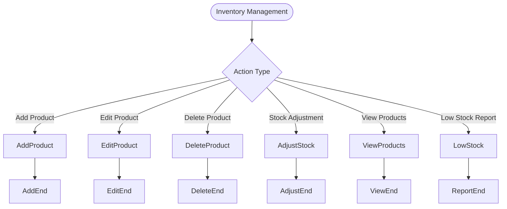
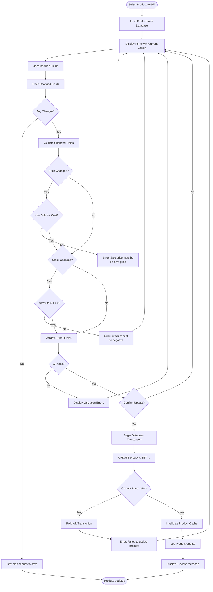
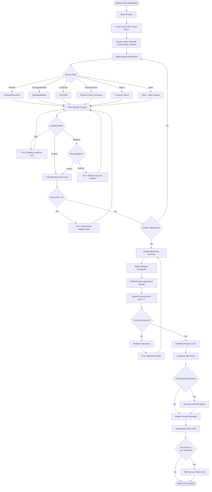
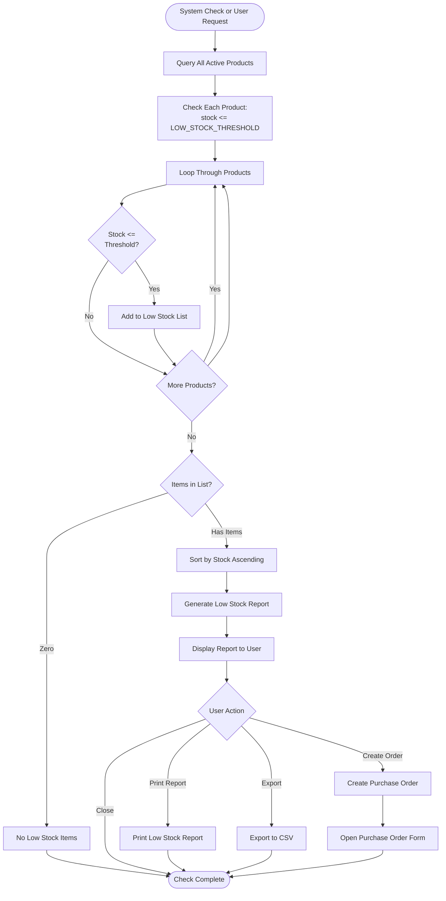
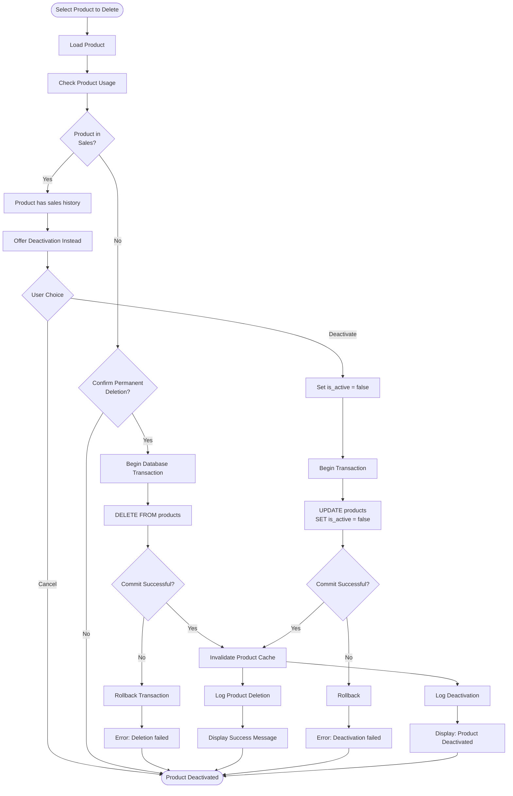
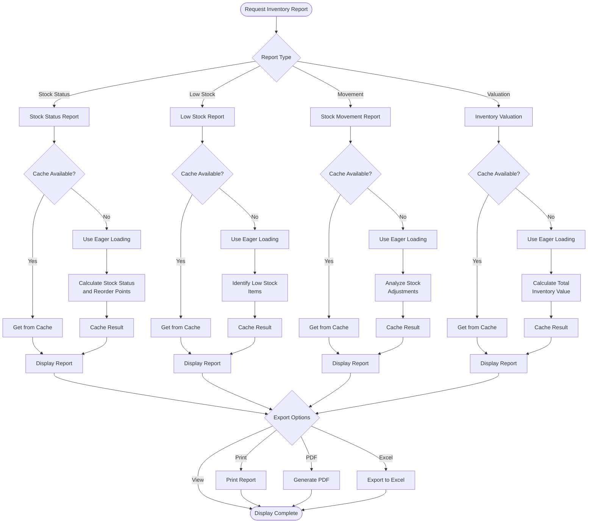
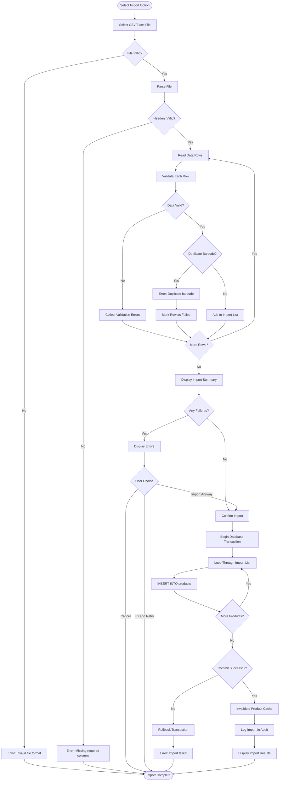

# ERP Paraguay V6 - Inventory Management Workflow

This document provides detailed flowcharts and documentation for the inventory management system in ERP Paraguay V6.

## Product Management Overview



## Add New Product Flow

```mermaid
flowchart TD
    Start([Click "Add Product"]) --> ShowForm[Display Product Form]
    ShowForm --> EnterBasic[Enter Basic Information]

    EnterBasic --> EnterName[Enter Product Name]
    EnterName --> EnterBarcode[Enter/Generate Barcode]
    EnterBarcode --> EnterDesc[Enter Description]
    EnterDesc --> EnterPricing[Enter Pricing]

    EnterPricing --> EnterCost[Enter Cost Price]
    EnterCost --> EnterSale[Enter Sale Price]
    EnterSale --> ValidateMargin{Sale Price >=<br/>Cost Price?}
    ValidateMargin --> |No| ErrorMargin[Error: Sale price must be<br/>>= cost price]
    ValidateMargin --> |Yes| EnterStock

    ErrorMargin --> EnterSale

    EnterStock[Enter Initial Stock] --> ValidateStock{Stock >= 0?}
    ValidateStock --> |No| ErrorStock[Error: Stock cannot<br/>be negative]
    ValidateStock --> |Yes| SelectCategory

    ErrorStock --> EnterStock

    SelectCategory[Select Category] --> CheckCategory{Category Selected?}
    CheckCategory --> |No| CreateCategory[Create New Category]
    CheckCategory --> |Yes| SelectSupplier
    CreateCategory --> SelectSupplier

    SelectSupplier[Select Supplier] --> CheckSupplier{Supplier Selected?}
    CheckSupplier --> |No| CreateSupplier[Create New Supplier]
    CheckSupplier --> |Yes| ValidateForm

    CreateSupplier --> ValidateForm[Validate All Fields]

    ValidateForm --> ValidationCheck{All Valid?}
    ValidationCheck --> |No| ShowErrors[Display Validation Errors]
    ShowErrors --> ShowForm

    ValidationCheck --> |Yes| ConfirmSave{Confirm Save?}
    ConfirmSave --> |No| ShowForm
    ConfirmSave --> |Yes| CheckDuplicate[Check for Duplicate Barcode]

    CheckDuplicate --> DuplicateExists{Barcode<br/>Exists?}
    DuplicateExists --> |Yes| ErrorDuplicate[Error: Barcode already<br/>in use]
    DuplicateExists --> |No| BeginTxn[Begin Database Transaction]

    ErrorDuplicate --> EnterBarcode

    BeginTxn --> InsertProduct[INSERT INTO products]
    InsertProduct --> CommitTxn{Commit Successful?}

    CommitTxn --> |No| RollbackTxn[Rollback Transaction]
    RollbackTxn --> ErrorDB[Error: Failed to save product]
    ErrorDB --> ShowForm

    CommitTxn --> |Yes| InvalidateCache[Invalidate Product Cache]
    InvalidateCache --> LogAudit[Log Product Creation]
    LogAudit --> NotifySuccess[Display Success Message]
    NotifySuccess --> ClearForm[Clear Form]
    ClearForm --> OfferAnother{Add Another Product?}

    OfferAnother --> |Yes| ShowForm
    OfferAnother --> |No| End([Product Added])
```

## Edit Product Flow



## Stock Adjustment Flow



## Low Stock Alert Flow



## Product Deletion Flow



## Category Management Flow

```mermaid
flowchart TD
    Start([Category Management]) --> Action{Action Type}

    Action -->|View Categories| ViewCategories[List All Categories]
    Action -->|Add Category| AddCategory
    Action -->|Edit Category| EditCategory
    Action -->|Delete Category| DeleteCategory

    ViewCategories --> DisplayCategories[Display Categories with<br/>Product Count]
    DisplayCategories --> ViewEnd([View Complete])

    AddCategory --> ShowAddForm[Display Category Form]
    ShowAddForm --> EnterName[Enter Category Name]
    EnterName --> EnterDesc[Enter Description (Optional)]
    EnterDesc --> ValidateCategory[Validate Category]
    ValidateCategory --> CategoryValid{Valid?}
    CategoryValid --> |No| ShowCategoryError[Display Error]
    ShowCategoryError --> ShowAddForm
    CategoryValid --> |Yes| CheckDuplicateCategory{Duplicate Name?}
    CheckDuplicateCategory --> |Yes| ErrorDuplicate[Error: Category name exists]
    ErrorDuplicate --> ShowAddForm
    CheckDuplicateCategory --> |No| SaveCategory[Save Category to DB]
    SaveCategory --> CategorySuccess([Category Created])

    EditCategory --> SelectCategory[Select Category to Edit]
    SelectCategory --> LoadCategory[Load Category Data]
    LoadCategory --> ShowEditForm[Display Edit Form]
    ShowEditForm --> ModifyCategory[User Modifies Fields]
    ModifyCategory --> ValidateEdit[Validate Changes]
    ValidateEdit --> EditValid{Valid?}
    EditValid --> |No| ShowEditError[Display Error]
    ShowEditError --> ShowEditForm
    EditValid --> |Yes| UpdateCategory[Update Category in DB]
    UpdateCategory --> EditSuccess([Category Updated])

    DeleteCategory --> SelectDeleteCategory[Select Category]
    SelectDeleteCategory --> CheckProducts{Has Products?}
    CheckProducts --> |Yes| ShowProductError[Error: Category has products]
    ShowProductError --> OfferReassign[Offer to Reassign Products]
    OfferReassign --> ReassignProducts[Reassign Products to Other Category]
    ReassignProducts --> CheckProducts
    CheckProducts --> |No| ConfirmDeleteCategory{Confirm Deletion?}
    ConfirmDeleteCategory --> |No| DeleteEnd([Cancelled])
    ConfirmDeleteCategory --> |Yes| DeleteCategoryRecord[Delete Category from DB]
    DeleteCategoryRecord --> DeleteSuccess([Category Deleted])
```

## Supplier Management Flow

```mermaid
flowchart TD
    Start([Supplier Management]) --> Action{Action Type}

    Action -->|View Suppliers| ViewSuppliers[List All Suppliers]
    Action -->|Add Supplier| AddSupplier
    Action -->|Edit Supplier| EditSupplier
    Action -->|Delete Supplier| DeleteSupplier

    ViewSuppliers --> DisplaySuppliers[Display Suppliers with<br/>Product Count]
    DisplaySuppliers --> ViewEnd([View Complete])

    AddSupplier --> ShowAddForm[Display Supplier Form]
    ShowAddForm --> EnterName[Enter Supplier Name]
    EnterName --> EnterContact[Enter Email, Phone, Address]
    EnterContact --> EnterTaxID[Enter Tax ID (Optional)]
    EnterTaxID --> ValidateSupplier[Validate Supplier]
    ValidateSupplier --> SupplierValid{Valid?}
    SupplierValid --> |No| ShowSupplierError[Display Error]
    ShowSupplierError --> ShowAddForm
    SupplierValid --> |Yes| CheckDuplicateSupplier{Duplicate Email/Tax ID?}
    CheckDuplicateSupplier --> |Yes| ErrorDuplicate[Error: Supplier exists]
    ErrorDuplicate --> ShowAddForm
    CheckDuplicateSupplier --> |No| SaveSupplier[Save Supplier to DB]
    SaveSupplier --> SupplierSuccess([Supplier Created])

    EditSupplier --> SelectSupplier[Select Supplier to Edit]
    SelectSupplier --> LoadSupplier[Load Supplier Data]
    LoadSupplier --> ShowEditForm[Display Edit Form]
    ShowEditForm --> ModifySupplier[User Modifies Fields]
    ModifySupplier --> ValidateEdit[Validate Changes]
    ValidateEdit --> EditValid{Valid?}
    EditValid --> |No| ShowEditError[Display Error]
    ShowEditError --> ShowEditForm
    EditValid --> |Yes| UpdateSupplier[Update Supplier in DB]
    UpdateSupplier --> EditSuccess([Supplier Updated])

    DeleteSupplier --> SelectDeleteSupplier[Select Supplier]
    SelectDeleteSupplier --> CheckProducts{Has Products?}
    CheckProducts --> |Yes| ShowProductError[Error: Supplier has products]
    ShowProductError --> OfferReassign[Offer to Reassign Products]
    OfferReassign --> ReassignProducts[Reassign Products]
    ReassignProducts --> CheckProducts
    CheckProducts --> |No| ConfirmDeleteSupplier{Confirm Deletion?}
    ConfirmDeleteSupplier --> |No| DeleteEnd([Cancelled])
    ConfirmDeleteSupplier --> |Yes| DeleteSupplierRecord[Delete Supplier from DB]
    DeleteSupplierRecord --> DeleteSuccess([Supplier Deleted])
```

## Inventory Report Generation



## Batch Import Flow



## Inventory Business Rules

### Product Validation

1. **Required Fields**
   - Name: Required, max 100 characters
   - Cost Price: Required, must be positive
   - Sale Price: Required, must be >= cost price
   - Stock: Required, must be >= 0
   - Category: Required

2. **Optional Fields**
   - Barcode: Optional, must be unique if provided
   - Description: Optional, free text
   - Supplier: Optional

3. **Business Rules**
   - Sale price must be >= cost price (enforced)
   - Stock cannot be negative (enforced)
   - Barcodes must be unique (enforced)
   - Product names are case-insensitive unique (recommended)

### Stock Management

1. **Stock Deduction**
   - Occurs when sale is completed
   - Quantity deducted per sale item
   - Validation prevents insufficient stock
   - Transactional: all or nothing

2. **Stock Restoration**
   - Occurs when sale is cancelled
   - Full quantity restored per sale item
   - Automatic with sale cancellation

3. **Stock Adjustments**
   - Can increase or decrease stock
   - Requires reason code
   - Creates audit trail
   - Cannot result in negative stock

4. **Low Stock Threshold**
   - Default: 10 units
   - Configurable via LOW_STOCK_THRESHOLD
   - Triggers alerts and reports
   - Checked on stock changes

### Category Management

1. **Category Rules**
   - Name must be unique
   - Can be deactivated (not deleted if has products)
   - Products can be reassigned
   - Optional description field

2. **Category Deletion**
   - Only allowed if no products assigned
   - Or products must be reassigned first
   - Deactivation preferred over deletion

### Supplier Management

1. **Supplier Rules**
   - Email must be unique (if provided)
   - Tax ID must be unique (if provided)
   - Can be deactivated (not deleted if has products)
   - Products can be reassigned

2. **Supplier Deletion**
   - Only allowed if no products assigned
   - Or products must be reassigned first
   - Deactivation preferred over deletion

---

**Document Version:** 1.0
**Last Updated:** 2025-03-14
