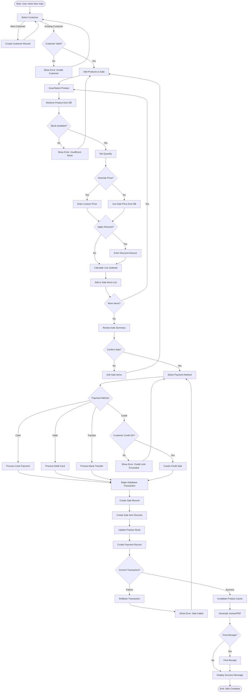
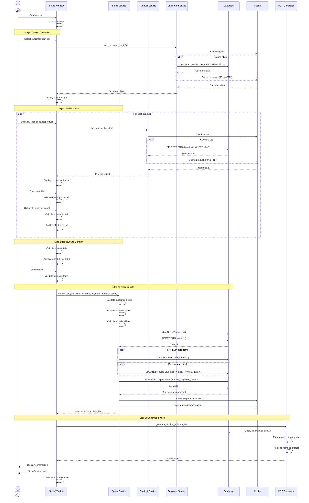
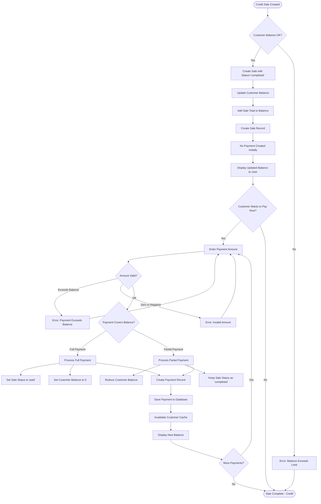
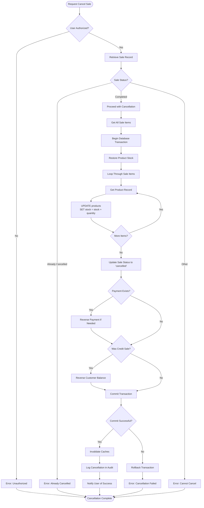
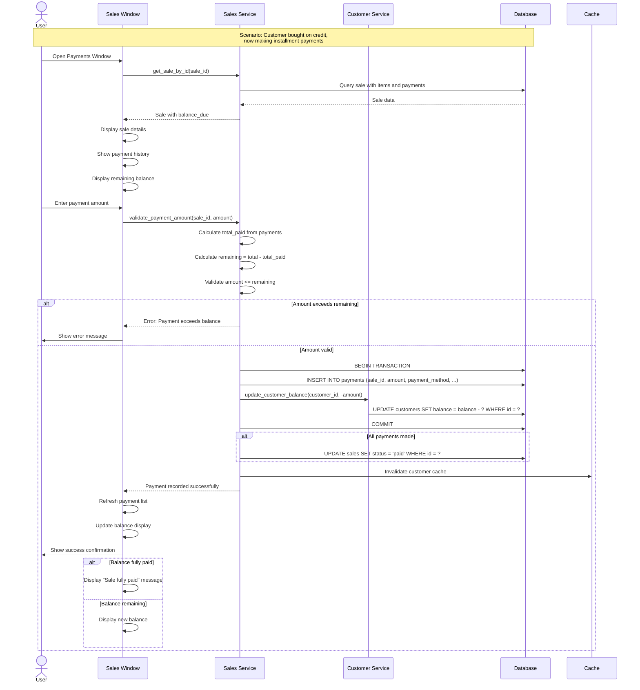
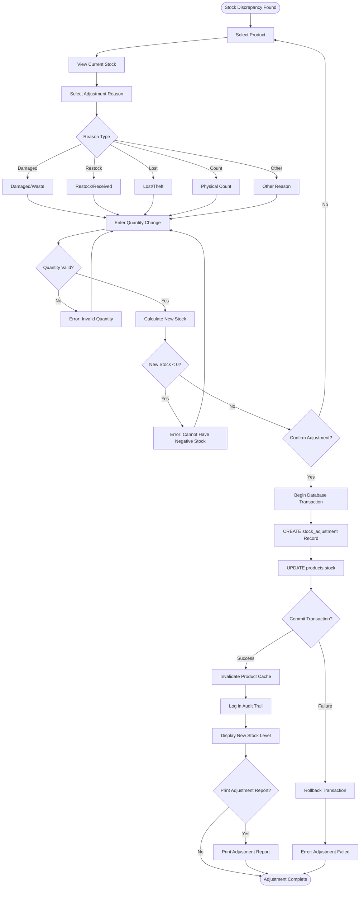
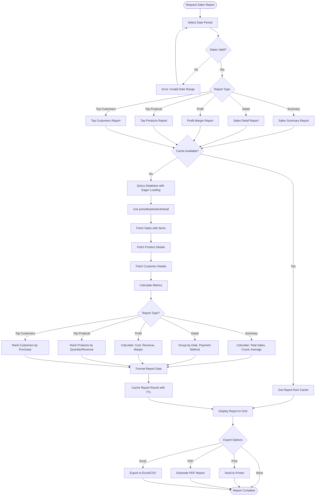

# ERP Paraguay V6 - Sales Workflow

This document provides detailed flowcharts and documentation for the sales management workflow in ERP Paraguay V6.

## Complete Sales Process Flow



## Cash Sale Detailed Flow



## Credit Sale with Payment Flow



## Sale Cancellation Flow



## Multiple Installments Flow



## Stock Adjustment Workflow



## Sales Report Generation Flow



## Error Handling in Sales Flow

```mermaid
flowchart TD
    Start([Sale Operation Started]) --> TryOperation[Try Database Operation]
    TryOperation --> Success{Operation Successful?}

    Success --> |Yes| LogSuccess[Log Success Event]
    LogSuccess --> CommitTransaction[Commit Transaction]
    CommitTransaction --> InvalidateCache[Invalidate Relevant Caches]
    InvalidateCache --> NotifySuccess[Notify User of Success]
    NotifySuccess --> End([Operation Complete])

    Success --> |No| CatchError[Catch Exception]
    CatchError --> ErrorType{Error Type}

    ErrorType -->|ValidationError| HandleValidation[Handle Validation Error]
    ErrorType -->|NotFoundError| HandleNotFound[Handle Not Found Error]
    ErrorType -->|BusinessRuleError| HandleBusinessRule[Handle Business Rule Error]
    ErrorType -->|DatabaseError| HandleDatabase[Handle Database Error]
    ErrorType -->|Other| LogUnknown[Log Unknown Error]

    HandleValidation --> UserValidation[Show User-Friendly Validation Message]
    HandleNotFound --> UserNotFound[Show "Record Not Found" Message]
    HandleBusinessRule --> UserBusinessRule[Show Business Rule Violation]
    HandleDatabase --> LogDatabaseError[Log Database Error with Stack Trace]
    LogUnknown --> LogUnknownError[Log Error with Full Context]

    UserValidation --> CheckTransaction{Transaction Active?}
    UserNotFound --> CheckTransaction
    UserBusinessRule --> CheckTransaction
    LogDatabaseError --> RollbackTransaction
    LogUnknownError --> RollbackTransaction

    CheckTransaction --> |Yes| RollbackTransaction[Rollback Transaction]
    CheckTransaction --> |No| EndError([End with Error])

    RollbackTransaction --> NotifyError[Notify User of Error]
    NotifyError --> LogAudit[Log Error in Audit Trail]
    LogAudit --> EndError
```

## Key Business Rules

### Sale Validation Rules

1. **Customer Requirements**
   - Customer must exist and be active
   - For credit sales: customer balance + sale total <= credit limit

2. **Product Requirements**
   - All products must exist and be active
   - Quantity must be positive
   - Quantity must not exceed available stock
   - Unit price must be positive (or zero for free items)

3. **Pricing Rules**
   - Default unit price = product.sale_price
   - Override allowed with proper authorization
   - Discount cannot exceed unit price
   - Line subtotal = (unit_price × quantity) - discount

4. **Payment Rules**
   - Cash: Payment amount must equal sale total
   - Credit: No payment required at time of sale
   - Debit/Transfer: Payment amount must equal sale total

5. **Tax Calculation**
   - Tax rate = TAX_RATE (default 10%)
   - Tax amount = subtotal × TAX_RATE
   - Total = subtotal + tax_amount

### Stock Management Rules

1. **Stock Deduction**
   - Stock deducted when sale is completed
   - Quantity deducted per sale item
   - Stock cannot go negative (validation prevents this)

2. **Stock Restoration**
   - Stock restored when sale is cancelled
   - Full quantity restored per sale item
   - Transactional: all or nothing

3. **Stock Adjustments**
   - Can increase or decrease stock
   - Requires reason for audit trail
   - Cannot result in negative stock

### Payment Rules

1. **Payment Validation**
   - Payment amount must be positive
   - Payment amount cannot exceed sale total (for cash/debit/transfer)
   - Payment amount cannot exceed remaining balance (for credit sales)

2. **Multiple Payments**
   - Multiple payments allowed for credit sales
   - Sum of payments cannot exceed sale total
   - Sale status changes to 'paid' when fully paid

3. **Payment Methods**
   - Cash: Immediate payment
   - Credit: Adds to customer balance
   - Debit: Electronic payment
   - Transfer: Bank transfer

---

**Document Version:** 1.0
**Last Updated:** 2025-03-14
